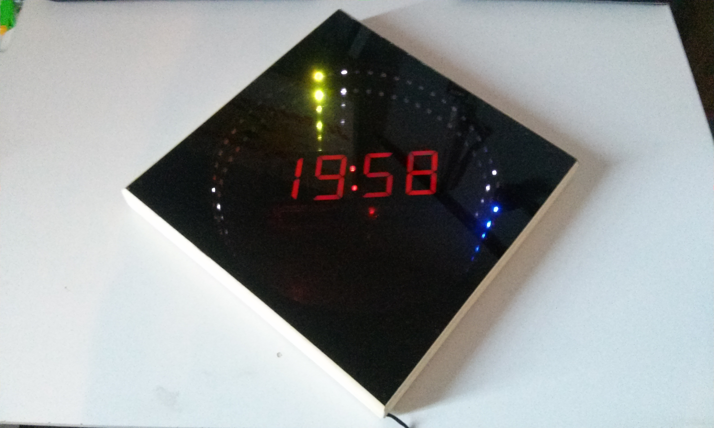

# infinity-mirror-clock

spi led strip led with arduino nano

## techno

* arduino nano
* spi led strip
* rtc 1307 module
* 7 segment displays
* 2 leds
* 16 pin puissance composant
* mosfet transistor
* 433Mhz radio module

  
  
   
  
  

